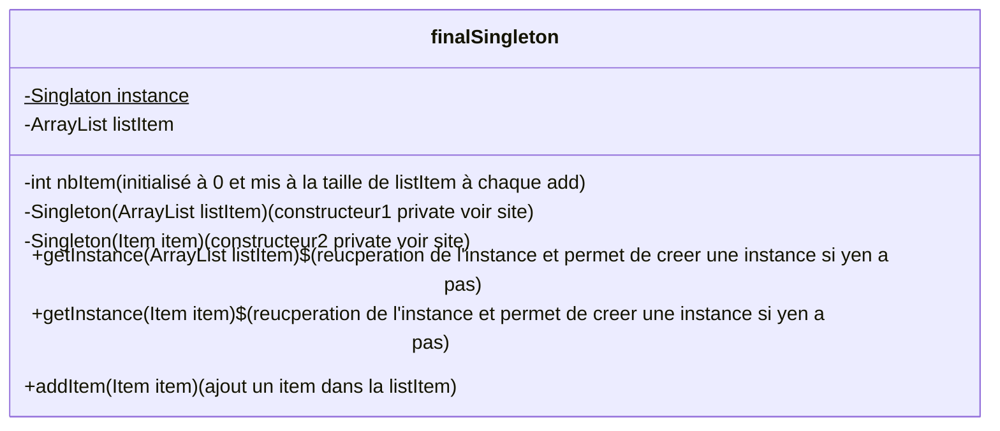
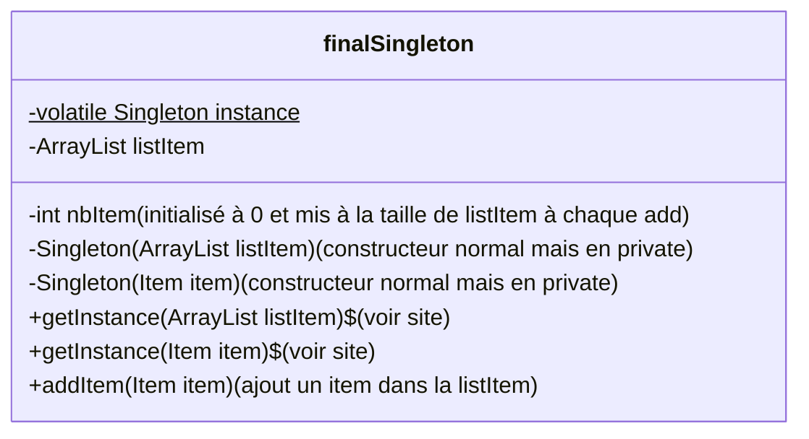
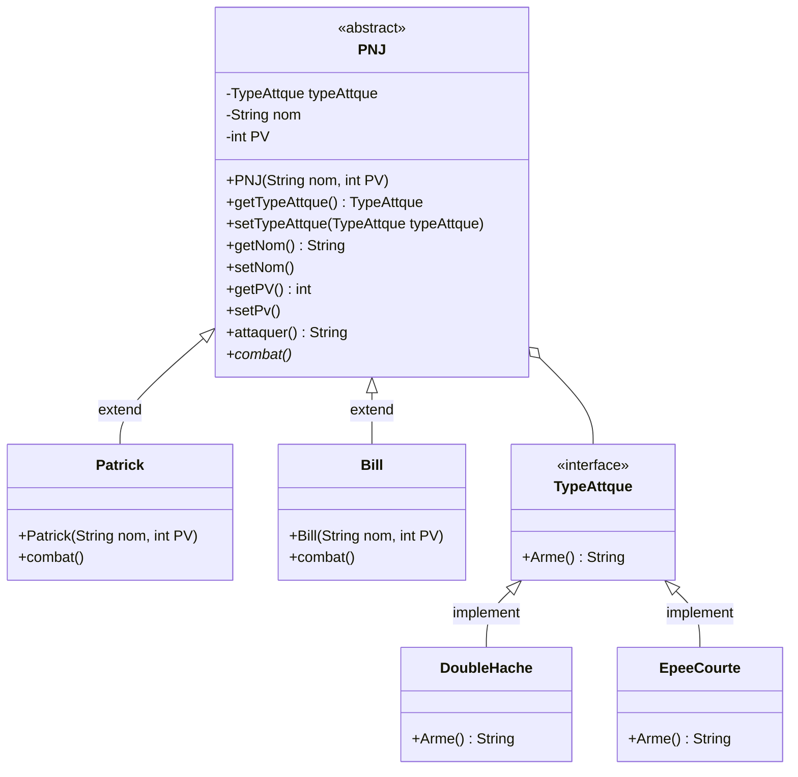

# Wiki

## Sommaire
> [Diagramme de class Singleton](#singleton)
> - [Singleton monothread](#singleton-monothread)
> - [Sigleton thread-safe](#sigleton-thread-safe)
> 
> [Diagramme de class Strategy](#strategy)

## Singleton
### Singleton monothread
Cette version possède un gros défault elle ne prend pas en compte le multithreading, elle n'est donc pas thread-safe
Dans le cas que l'on va dévelloper ici, nous sommes dans un jeux dans lequel les joueurs ont un inventaire. Cette inventaire est un Singleton car partout dans l'application il doit être accessible.

### Sigleton thread-safe
Pour régler le pb du multithreading on doit synchroniser les threads lors de la création du Singleton
La méthode qu'on va utilisé est le DCL (double(checked locking)

## Strategy
Pour le design pattern de Strategy on est partie sur un système de manipulation de différentes des personnages dans un jeux
Dans notre modèle nous avons une classe : PNJ avec des comportement comme Pattrick, Bill

